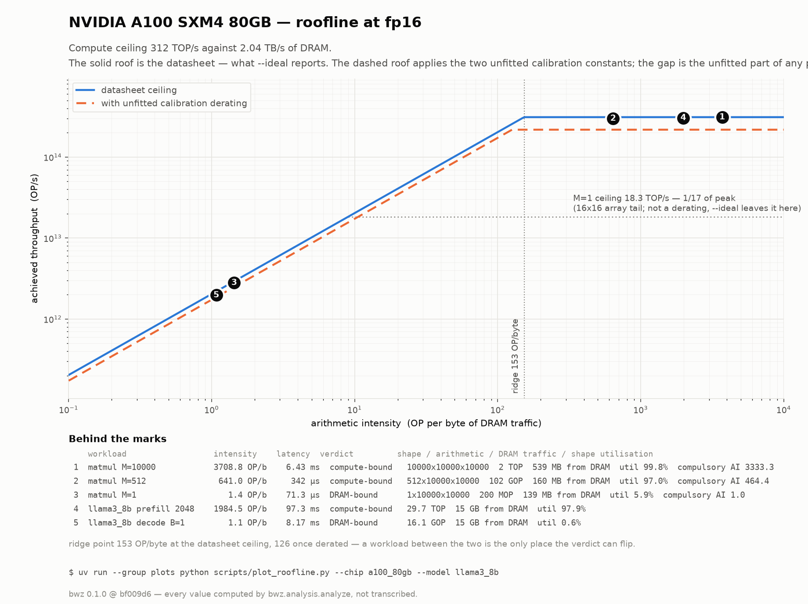

# bandwidth-zen

**Can I run this model on this chip — and if so, how fast?**

`bandwidth-zen` is an analytical performance model for neural-network inference. Give it a model
(transformer LLM or CNN) and a chip (or a multi-chip system), and it predicts latency, throughput,
utilization, memory footprint, and energy — then tells you **what the bottleneck is and what to do
about it**, with the numbers behind every claim.

It is fast enough to explore hundreds of configurations interactively, and honest enough to show you
every assumption it made.

> ⚠️ **These are estimates, not measurements.** Typical error is ±15–25% against published
> benchmarks. See [Accuracy](#accuracy) and `docs/CALIBRATION.md`.

---

## What it does

- **Decomposes** a model into a DAG of operations with FLOP and byte counts per memory level
- **Maps** each operation onto the chip: which compute unit, which tile sizes, what fits in SRAM
- **Predicts** latency via a flat roofline (compute ridge vs DRAM ridge; the on-chip SRAM enters
  as a tile-buffer capacity) plus tail-effect and pipeline-fill utilization modelling
- **Separates prefill from decode** for LLMs — they are different machines, and the tool shows why
- **Scales out** across chips: tensor / pipeline / data / expert parallelism with alpha-beta
  collective costs over hierarchical topologies (NVLink intra-node, InfiniBand inter-node)
- **Plans memory**: weights + KV cache + peak live activations + workspace vs. device capacity,
  including the context length at which you hit the memory wall
- **Explains**: ranked bottlenecks, roofline position per op, Gantt timeline, and quantified
  suggestions ("quantize to INT8: −38% latency" — re-simulated, not guessed)
- **Explores**: sweep batch × precision × parallelism and get the Pareto frontier

## What it is not

Not a cycle-accurate simulator, not a compiler, not a benchmark harness. It doesn't run your model.
It won't capture kernel-selection quirks, thermal throttling, or your framework's overhead. Use it
for design-space exploration and sanity-checking, then measure on real hardware.

---

## Quickstart

**Environment setup (do this first after cloning).** The backend requires Python ≥ 3.11 and is
managed with [uv](https://docs.astral.sh/uv/) — do not use `python -m venv`; uv downloads its own
Python 3.11 interpreter if the system one is older:

```bash
git clone https://github.com/<you>/bandwidth-zen && cd bandwidth-zen
make venv         # creates backend/.venv (uv venv --python 3.11 + uv sync --all-groups)
```

Then either prefix commands with `uv run` from `backend/` (recommended — no activation needed),
or activate classically with `source backend/.venv/bin/activate`.

**[`docs/CLI.md`](docs/CLI.md) is the full command reference** — every flag, and the exact
invocation behind every number quoted in this README.

```bash
make dev          # backend on :8000, UI on :5173  (no-op until M4 — backend-only phase)
```

Or from the CLI:

```bash
uv run bwz run \
  --model llama3_8b --chip h100_sxm \
  --batch 1 --input-tokens 2048 --output-tokens 256 \
  --precision fp16 --attention flash2
```

```
Llama-3-8B  ·  NVIDIA H100 SXM5  ·  fp16  ·  batch 1  ·  2048 in / 256 out

  TTFT              68.4 ms          prefill, compute-bound (54% of peak)
  TPOT              21.7 ms          decode,  DRAM-bandwidth-bound (91% of peak BW)
  End-to-end         5.62 s
  Throughput        46.1 tok/s
  Peak memory       17.4 GB / 77.3 GB usable        KV cache 1.07 GB @ 2304 ctx
  Energy            0.42 J/token                     avg 421 W

  Top bottlenecks (decode)
    1  ffn.down_proj        DRAM_BW_BOUND    31%   AI 0.9   →  INT8 weights: −34%
    2  ffn.gate_up_proj     DRAM_BW_BOUND    28%   AI 0.9
    3  attn.qkv_proj        DRAM_BW_BOUND    14%   AI 0.9
    4  attn.scores          DRAM_BW_BOUND     9%   AI 2.1   →  already flash2

  Confidence: medium (±20%) — decode weight traffic dominates; assumes no weight caching in L2
```

Interrogate the machine rather than a network — one matrix multiply, in matmul vocabulary
(operands A and B, result C — no weights, no activations, no batch or context knobs; `M` folds the
batch in):

```bash
uv run bwz matmul -M 10000 -N 10000 -K 10000 --chip a100_80gb --dtype fp16 --ideal
```

```
       A 10000x10000 fp16  x  B 10000x10000 fp16  ->  C 10000x10000 fp16
                          on NVIDIA A100 SXM4 80GB

  operations                2 TOP    2 x 10000 x 10000 x 10000 — unchanged by the result width
  arithmetic runs at        fp16     tensor_core peak 312 TOP/s
  intensity        3333.3 OP/byte    operations / compulsory traffic
  ridge point       153.0 OP/byte    above it the chip is compute-bound
  shape utilisation        99.84%    systolic tail on a 16x16 array — geometry, not a derating
  t_dram                   264 µs
  t_compute               6.42 ms
  latency                 6.43 ms
  verdict           COMPUTE_BOUND
```

`--ideal` sets both efficiency de-ratings to 1.0, so every number above can be checked against the
datasheet by hand. Drop `-M` to 1 and the same matmul reports 5.88% utilisation — `1/17` of the
array — and flips to DRAM-bound.

Widths are per operand, and the result width is the **accumulator** width — it changes bytes only,
never operations:

```bash
uv run bwz matmul -M 4096 -N 4096 -K 4096 -c a100_80gb --dtype int8               # all int8
uv run bwz matmul -M 4096 -N 4096 -K 4096 -c a100_80gb --dtype int8 --out int32   # int32 accumulate
uv run bwz matmul -M 4096 -N 4096 -K 4096 -c a100_80gb --dtype fp16 --out fp32    # all float
uv run bwz matmul -M 4096 -N 4096 -K 4096 -c a100_80gb --a fp16 --b int8          # mixed operands
```

All four do the same 137.4 GOP. The int32 result quadruples C from 16.8 MB to 67.1 MB and halves
the arithmetic intensity; the mixed-operand case runs at the **fp16** rate, because both operands
share one datapath — the narrow side saves bytes and buys no throughput.

See where the time went — one figure per chip, since the schedule is a property of the machine:

```bash
make plots        # → docs/plots/
```

That writes, per chip: the roofline, the machine diagram, and the resource timeline as both a PNG
and a **zoomable** self-contained `timeline-*.html` (wheel to zoom, drag to pan, hover a bar for
its bytes and rate). The figures are separate from the text report above — see
[`docs/CLI.md`](docs/CLI.md) §5.




The same 4096³ matmul is 4% DRAM-busy on A100 and touches DRAM not at all on `chip_a`, whose 55 MB
of SRAM holds all of operand B. The spans are a decomposition of the reported latency rather than a
second model: DRAM busy sums to `t_dram`, core busy to `t_compute + t_fixed`.

Every figure is computed by calling `analyze()`, not drawn by hand, and carries the command that
produced it. See [`backend/scripts/`](backend/scripts/).

Sweep and take the Pareto frontier:

```bash
uv run bwz sweep --model llama3_8b --chip h100_sxm \
  --knob batch=1,4,16,64,256 --knob precision=fp16,int8 --knob tp=1,2,4,8 \
  --objective latency,throughput --out sweep.json
```

Docker:

```bash
docker compose up      # http://localhost:5173
```

---

## The model, briefly

Full derivations in [`docs/MODEL.md`](docs/MODEL.md). The core is a roofline with a compute
ceiling and a DRAM ceiling; the on-chip SRAM enters as a tile-buffer capacity that constrains
tiling:

```
AI          = FLOPs / bytes_moved_at_level
t_compute   = FLOPs / (peak_flops_per_s × utilization_efficiency)
t_memory    = bytes_moved / (bandwidth × bandwidth_efficiency)
t_op        = max(t_compute, t_memory)            # or sum, if the chip can't overlap
```

Four things would make it more than a textbook roofline. **Two are implemented and two are not** —
`docs/MODEL.md` says which formula is live:

1. **`utilization_efficiency` is derived, not assumed.** *(implemented)* The systolic tail effect,
   `[K/padded(K)]·[N/padded(N)]·[M/(M+rows)]`. This is why a matmul with M=1 on a 128×128 array
   gets ~1/128 of peak — and why LLM decode looks the way it does. Pipeline fill/drain is
   **not** folded in here: it is reported separately by the tile schedule (§6.5), because the
   roofline's `max(load, compute)` is the many-tiles limit and hiding the difference inside a
   utilisation figure would make it unfalsifiable.
2. **On-chip capacity decides overlap and residency.** *(implemented)* Capacity is allocated
   double buffer → activations → weights, and whether two tiles fit is what earns
   `max(load, compute)` instead of `load + compute`.
3. **`bytes_moved` from a tile-reuse search.** *(not implemented — v1 charges compulsory traffic.)*
   The target is `M·K·⌈N/Tn⌉ + K·N·⌈M/Tm⌉ + M·N` over a search of tile sizes; v1 charges each
   operand once, which is the traffic of an ideal schedule and therefore a **lower bound** once the
   working set stops fitting on chip. Quantified in `docs/MODEL.md` §6.2 — 1.5–2× at 16384³ — and
   stated in every report's assumptions drawer.
4. **Communication with alpha-beta costs on the real topology.** *(not implemented — M5.)* Ring
   allreduce as `2(N−1)α + 2(N−1)/N·S·β`, separate `(α, β)` per link class.

Energy (M7) is not implemented either. Nothing in this repo has been calibrated against a published
measurement yet, which is why no report claims better than medium confidence.

---

## Built-in profiles

**Chips:** NVIDIA H100 SXM / A100 80GB, AMD MI300X, Google TPU v4, Jetson Orin, a generic
edge NPU, a server CPU baseline. Each profile cites its datasheet in `source_url`.

**Models:** GPT-3, BERT-base, Llama-3-8B, Llama-2-70B, Mistral-7B, Mixtral-8x7B, Gemma-4,
MobileNetV3, ViT-B/16, Stable Diffusion U-Net.

Add your own — chips and models are plain YAML:

```yaml
name: My NPU
clock_ghz: 1.2
compute_units:
  - {name: systolic, count: 4, ops_per_cycle_per_unit: 16384,
     supported_dtypes: [int8, int4], systolic_dims: [128, 128], dataflow: ws}
memory:
  - {name: SRAM, level: 1, capacity_bytes: 67108864, bandwidth_bytes_per_s: 2.0e12, latency_ns: 5}
  - {name: LPDDR5, level: 3, capacity_bytes: 17179869184, bandwidth_bytes_per_s: 6.8e10, latency_ns: 120}
tdp_w: 60
```

See [`docs/SCHEMA.md`](docs/SCHEMA.md) for the full schema.

---

## Accuracy

Validated against published MLPerf Inference results and vendor benchmark posts. Current status
(see `docs/CALIBRATION.md` for the full table, sources, and outlier analysis):

| Workload class | Typical error | Confidence |
|---|---|---|
| LLM decode, single chip | ±15% | medium–high |
| LLM prefill, single chip | ±20% | medium |
| CNN inference, large batch | ±15% | medium |
| CNN inference, batch 1 | ±35% | low — launch overhead dominates |
| Multi-chip TP | ±25% | low–medium |
| Energy | ±50% | low |

Every report includes a `confidence` field and an assumptions list. Run `make validate` to
reproduce the table.

---

## Project layout

```
backend/bwz/
  spec/         pydantic schemas + YAML loaders
  graph/        ModelSpec → operation DAG (transformer, CNN builders)
  operators/    per-family cost models (matmul, conv, attention, norm, elementwise)
  analysis/     roofline, tiling, memory, schedule, parallelism, collectives, power, bottleneck
  api/, cli.py  thin shells over analyze(model, hardware, deployment) -> Report
  profiles/     chip and model YAML
backend/scripts/  figure generation (imports the engine; the engine never imports it)
frontend/src/   React + TS dashboard (roofline plot, Gantt, Pareto explorer)
docs/           CLI.md · MODEL.md · CALIBRATION.md · SCHEMA.md · CORRECTIONS.md · plots/
```

The analysis core is pure and dependency-free: `analyze()` is a deterministic function of its
inputs, which is what makes sweeps parallelizable and results reproducible.

---

## Contributing

Contributions especially welcome for: new chip profiles (with datasheet citations), reference
measurements for `docs/CALIBRATION.md`, and operator cost models (state-space/Mamba, MoE routing,
diffusion attention).

```bash
make lint test        # ruff + mypy --strict + pytest + vitest, all must pass
```

House rules, in short: SI units internally with unit-suffixed names; every empirical constant lives
in `calibration.py` with a source comment; physics code ships with a golden test in the same commit;
every profile YAML carries a `source_url`; and no fabricated measurements, ever — "no reference
point available" is a perfectly good entry in the calibration table.

Details in [`CLAUDE.md`](CLAUDE.md) (which is also the operating manual if you use Claude Code here).

---

## License

Apache-2.0
