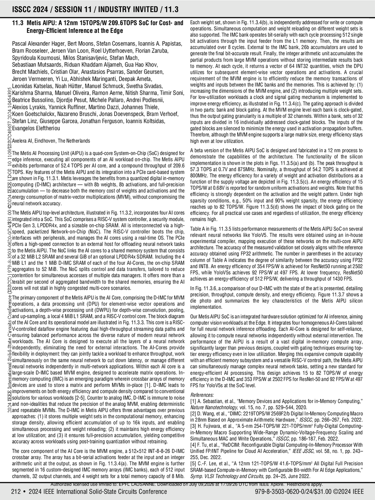
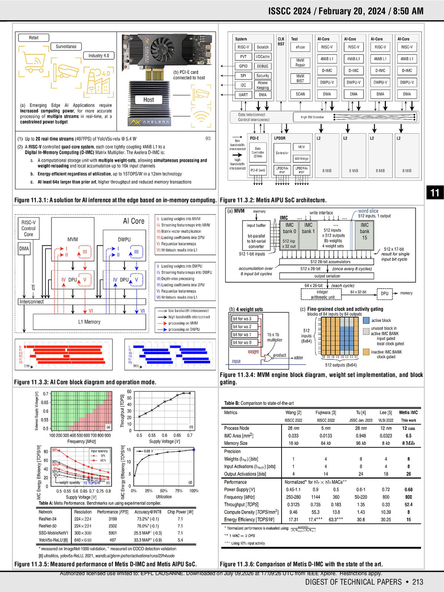
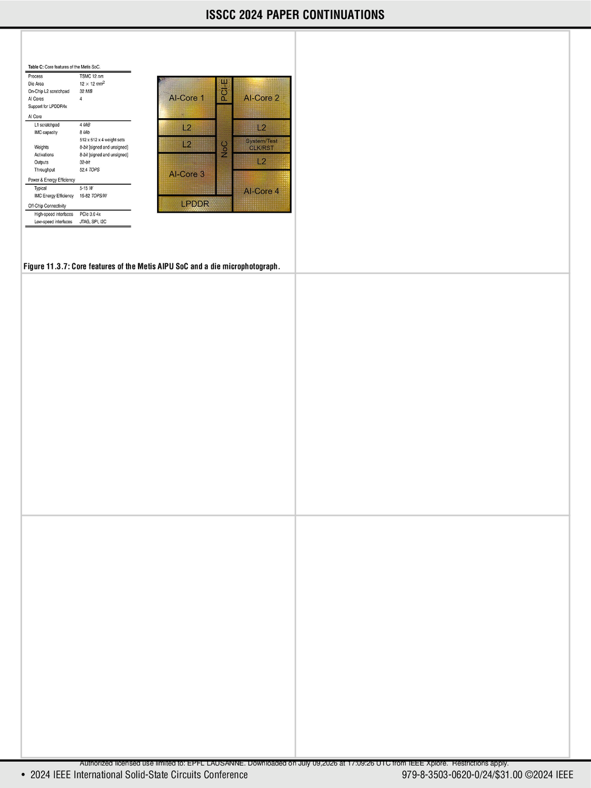

# Extracted Document

**Total Pages:** 3

---

212  
•  2024 IEEE International Solid-State Circuits Conference
ISSCC 2024 / SESSION 11 / INDUSTRY INVITED / 11.3
11.3  Metis AIPU: A 12nm 15TOPS/W 209.6TOPS SoC for Cost- and  
         Energy-Efficient Inference at the Edge 
 
Pascal Alexander Hager, Bert Moons, Stefan Cosemans, Ioannis A. Papistas,  
Bram Rooseleer, Jeroen Van Loon, Roel Uytterhoeven, Florian Zaruba,  
Spyridoula Koumousi, Milos Stanisavljevic, Stefan Mach,  
Sebastiaan Mutsaards, Riduan Khaddam Aljameh, Gua Hao Khov,  
Brecht Machiels, Cristian Olar, Anastasios Psarras, Sander Geursen,  
Jeroen Vermeeren, Yi Lu, Abhishek Maringanti, Deepak Ameta,  
Leonidas Katselas, Noah Hütter, Manuel Schmuck, Swetha Sivadas,  
Karishma Sharma, Manuel Oliveira, Ramon Aerne, Nitish Sharma, Timir Soni,  
Beatrice Bussolino, Djordje Pesut, Michele Pallaro, Andrei Podlesnii,  
Alexios Lyrakis, Yannick Ruffiner, Martino Dazzi, Johannes Thiele,  
Koen Goetschalckx, Nazareno Bruschi, Jonas Doevenspeck, Bram Verhoef,  
Stefan Linz, Giuseppe Garcea, Jonathan Ferguson, Ioannis Koltsidas,  
Evangelos Eleftheriou
 
 
Axelera AI, Eindhoven, The Netherlands 
 
The Metis AI Processing Unit (AIPU) is a quad-core System-on-Chip (SoC) designed for 
edge inference, executing all components of an AI workload on-chip. The Metis AIPU 
exhibits performance of 52.4 TOPS per AI core, and a compound throughput of 209.6 
TOPS. Key features of the Metis AIPU and its integration into a PCIe card-based system 
are shown in Fig. 11.3.1. Metis leverages the benefits from a quantized digital in-memory 
computing (D-IMC) architecture — with 8b weights, 8b activations, and full-precision 
accumulation — to decrease both the memory cost of weights and activations and the 
energy consumption of matrix-vector multiplications (MVM), without compromising the 
neural network accuracy.  
 
The Metis AIPU top-level architecture, illustrated in Fig. 11.3.2, incorporates four AI cores 
integrated into a SoC. This SoC comprises a RISC-V system controller, a security module, 
PCIe Gen 3, LPDDR4x, and a sizeable on-chip SRAM. All is interconnected via a high-
speed,  packetized  Network-on-Chip  (NoC).  The  RISC-V  controller  boots  the  chip,  
interfaces with peripherals, and manages the AI cores using a real-time OS. The PCIe 
offers a high-speed connection to an external host for offloading neural network tasks 
to the Metis AIPU. The NoC links the AI cores to a shared memory system that consists 
of a 32 MiB L2 SRAM and several GiB of an optional LPDDR4x SDRAM. Including the 4 
MiB L1 and the 1 MiB D-IMC SRAM of each of the four AI-Cores, the on-chip SRAM 
aggregates to 52 MiB. The NoC splits control and data transfers, tailored to reduce 
contention for simultaneous accesses of multiple data managers. It offers more than a 
terabit per second of aggregated bandwidth to the shared memories, ensuring the AI 
cores will not stall in highly congested multi-core scenarios.  
 
The primary component of the Metis AIPU is the AI Core, comprising the D-IMC for MVM 
operations,  a  data  processing  unit  (DPU)  for  element-wise  vector  operations  and  
activations, a depth-wise processing unit (DWPU) for depth-wise convolution, pooling, 
and up-sampling, a local 4 MiB L1 SRAM, and a RISC-V control core. The block diagram 
of the AI Core and its operational model are illustrated in Fig. 11.3.3. This core is a RISC-
V-controlled dataflow engine featuring dual high-throughput streaming data paths and 
ensuring balanced performance across the diverse nature of modern neural network 
workloads.  The  AI  Core  is  designed  to  execute  all  the  layers  of  a  neural  network  
independently,  eliminating  the  need  for  external  interactions.  The  AI-Cores  provide  
flexibility in deployment: they can jointly tackle a workload to enhance throughput, work 
simultaneously on the same neural network to cut down latency, or manage different 
neural networks independently in multi-network applications. Within each AI core is a 
large-scale D-IMC based MVM engine, designed to accelerate matrix operations. In-
memory computing (IMC) is an emerging paradigm wherein crossbar arrays of memory 
devices are used to store a matrix and perform MVMs in-place [1]. D-IMC leads to 
improvements on both energy efficiency and compute density compared to conventional 
solutions for various workloads [2-5]. Counter to analog IMC, D-IMC is immune to noise 
and non-idealities that reduce the precision of the analog MVM, enabling deterministic 
and repeatable MVMs. The D-IMC in Metis AIPU offers three advantages over previous 
approaches: (1) it stores multiple weight sets in the computational memory, enhancing 
storage  density,  allowing  efficient  accumulation  of  up  to  16k  inputs,  and  enabling  
simultaneous processing and weight reloading; (2) it maintains high energy efficiency 
at low utilization; and (3) it ensures full-precision accumulation, yielding competitive 
accuracy across workloads using post-training quantization without retraining.   
 
The core component of the AI Core is the MVM engine, a 512×512 INT-8-8-26 D-IMC 
crossbar array. The array has a bit-serial activations feeder at the input and an integer 
arithmetic unit at the output, as shown in Fig. 11.3.4(a). The MVM engine is further 
segmented in 16 custom-designed IMC memory arrays (IMC banks), each of 512 input 
channels, 32 output channels, and 4 weight sets for a total memory capacity of 8 Mib. 
Each weight set, shown in Fig. 11.3.4(b), is independently addressed for write or compute 
operations. Simultaneous computation and weight reloading on different weight sets is 
also supported. The IMC bank operates bit-serially with each cycle processing 512 single 
bit  activations  through  the  input  feeder  from  the  L1  memory.  Then,  the  results  are  
accumulated over 8 cycles. External to the IMC bank, 26b accumulators are used to 
generate the final bit-accurate result. Finally, the integer arithmetic unit accumulates the 
partial products from large MVM operations without storing intermediate results back 
to memory. At each cycle, it returns a vector of 64 INT32 quantities, which the DPU 
utilizes  for  subsequent  element-wise  vector  operations  and  activations.  A  crucial  
requirement  of  the  MVM  engine  is  to  efficiently  reduce  the  memory  transactions  of  
weights and inputs between the IMC banks and the memories. This is achieved by: (1) 
increasing the dimensions of the MVM engine, and (2) introducing multiple weight sets. 
For low-utilization workloads a clock and signal gating mechanism is implemented to 
improve energy efficiency, as illustrated in Fig. 11.3.4(c). The gating approach is divided 
in two parts: bank and block gating. At the MVM engine level each bank is clock-gated, 
thus the output gating granularity is a multiple of 32 channels. Within a bank, sets of 32 
inputs are divided in 16 individually addressed clock-gated blocks. The inputs of the 
gated blocks are silenced to minimize the energy used in activation propagation buffers. 
Therefore, although the MVM engine supports a large matrix size, energy efficiency stays 
high even at low utilization.   
 
A beta version of the Metis AIPU SoC is designed and fabricated in a 12 nm process to 
demonstrate  the  capabilities  of  the  architecture.  The  functionality  of  the  silicon  
implementation is shown in the plots in Figs. 11.3.5(a) and (b). The peak throughput is 
57.3 TOPS at 0.7V and 875MHz. Nominally, a throughput of 54.2 TOPS is achieved at 
800MHz. The energy efficiency for a variety of weight and activation distributions as a 
function of the supply voltage are depicted in Fig. 11.3.5(c). An energy efficiency of 15 
TOPS/W at 0.68V is reported for random uniform activations and weights. Note that this 
efficiency is strongly dependent on the activation and the weight pattern. Under high 
sparsity conditions, e.g., 50% input and 90% weight sparsity, the energy efficiency 
reaches up to 82 TOPS/W. Figure 11.3.5(d) shows the impact of block gating on the 
efficiency. For all practical use cases and regardless of utilization, the energy efficiency 
remains high.  
 
Table A in Fig. 11.3.5 lists performance measurements of the Metis AIPU SoC on several 
relevant  neural  networks  like  YoloV5.  The  results  were  obtained  using  an  in-house  
experimental compiler, mapping execution of these networks on the multi-core AIPU 
architecture. The accuracy of the measured validation set closely aligns with the reference 
accuracy obtained using FP32 arithmetic. The number in parentheses in the accuracy 
column of Table A indicates the degree of similarity between the accuracy using FP32 
and INT8. An energy efficiency of 354 FPS/W is achieved for ResNet50 running at 2502 
FPS,  while  YoloV5s  achieves  92  FPS/W  at  497  FPS.  At  lower  frequency,  ResNet50  
achieves an energy-efficiency of 512 FPS/W, delivering a throughput of 1430 FPS.  
 
In Fig. 11.3.6, a comparison of our D-IMC with the state of the art is presented, detailing 
precision, throughput, compute density, and energy efficiency. Figure 11.3.7 shows a 
die  photo  and  summarizes  the  key  characteristics  of  the  Metis  AIPU  silicon  
implementation. 
 
Our Metis AIPU SoC is an integrated hardware solution optimized for AI inference, aiming 
computer vision workloads at the Edge. It integrates four homogeneous AI-Cores tailored 
for full neural network inference offloading. Each AI-Core is designed for self-reliance, 
allowing it to compute neural networks independently without external intervention. The 
performance  of  the  AIPU  is  a  result  of  a  vast  digital  in-memory  compute  array,  
significantly larger than previous designs, coupled with gating techniques ensuring top-
tier energy efficiency even in low utilization. Merging this expansive compute capability 
with an efficient memory subsystem and a versatile RISC-V control path, the Metis AIPU 
can simultaneously manage complex neural network tasks, setting a new standard for 
energy-efficient  AI  processing.  This  design  achieves  15  to  82  TOPS/W  of  energy  
efficiency in the D-IMC and 353 FPS/W at 2502 FPS for ResNet-50 and 92 FPS/W at 497 
FPS for YoloV5s at the SoC level.  
 
References: 
[1] A. Sebastian, et al., “Memory Devices and Applications for in-Memory Computing,” 
Nature Nanotechnology, vol. 15, no. 7, pp. 529–544, 2020.  
[2] D. Wang, et al., “DIMC: 2219TOPS/W 2569F2/b Digital In-Memory Computing Macro 
in 28nm Based on Approximate Arithmetic Hardware,” ISSCC, pp. 266–267, Feb. 2022.  
[3] H. Fujiwara, et al., “A 5-nm 254-TOPS/W 221-TOPS/mm
2
 Fully-Digital Computing-
in-Memory  Macro  Supporting  Wide-Range  Dynamic-Voltage-Frequency  Scaling  and  
Simultaneous MAC and Write Operations,” ISSCC, pp. 186-187, Feb. 2022.  
[4] F. Tu, et al., “ReDCIM: Reconfigurable Digital Computing-In-Memory Processor With 
Unified FP/INT Pipeline for Cloud AI Acceleration,” IEEE JSSC, vol. 58, no. 1, pp. 243–
255, Dec. 2022.  
[5] C.-F. Lee, et al., “A 12nm 121-TOPS/W 41.6-TOPS/mm
2
 All Digital Full Precision 
SRAM-based Compute-in-Memory with Configurable Bit-width For AI Edge Applications,” 
Symp. VLSI Technology and Circuits, pp. 24–25, June 2022.
979-8-3503-0620-0/24/$31.00 ©2024 IEEE
2024 IEEE International Solid-State Circuits Conference (ISSCC) | 979-8-3503-0620-0/24/$31.00 ©2024 IEEE | DOI: 10.1109/ISSCC49657.2024.10454395
Authorized licensed use limited to: EPFL LAUSANNE. Downloaded on July 09,2026 at 17:09:26 UTC from IEEE Xplore.  Restrictions apply. 

213  
ISSCC 2024 / February 20, 2024 / 8:50 AM
DIGEST OF TECHNICAL PAPERS  •
Figure 11.3.1: A solution for AI inference at the edge based on in-memory computing.
Figure 11.3.2: Metis AIPU SoC architecture.
Figure 11.3.3: AI Core block diagram and operation mode.
Figure 11.3.4: MVM engine block diagram, weight set implementation, and block 
gating.
Figure 11.3.5: Measured performance of Metis D-IMC and Metis AIPU SoC.
Figure 11.3.6: Comparison of Metis D-IMC with the state of the art.
11
Authorized licensed use limited to: EPFL LAUSANNE. Downloaded on July 09,2026 at 17:09:26 UTC from IEEE Xplore.  Restrictions apply. 

•  2024 IEEE International Solid-State Circuits Conference
ISSCC 2024 PAPER CONTINUATIONS
979-8-3503-0620-0/24/$31.00 ©2024 IEEE
Figure 11.3.7: Core features of the Metis AIPU SoC and a die microphotograph.
Authorized licensed use limited to: EPFL LAUSANNE. Downloaded on July 09,2026 at 17:09:26 UTC from IEEE Xplore.  Restrictions apply. 

## Page Images

