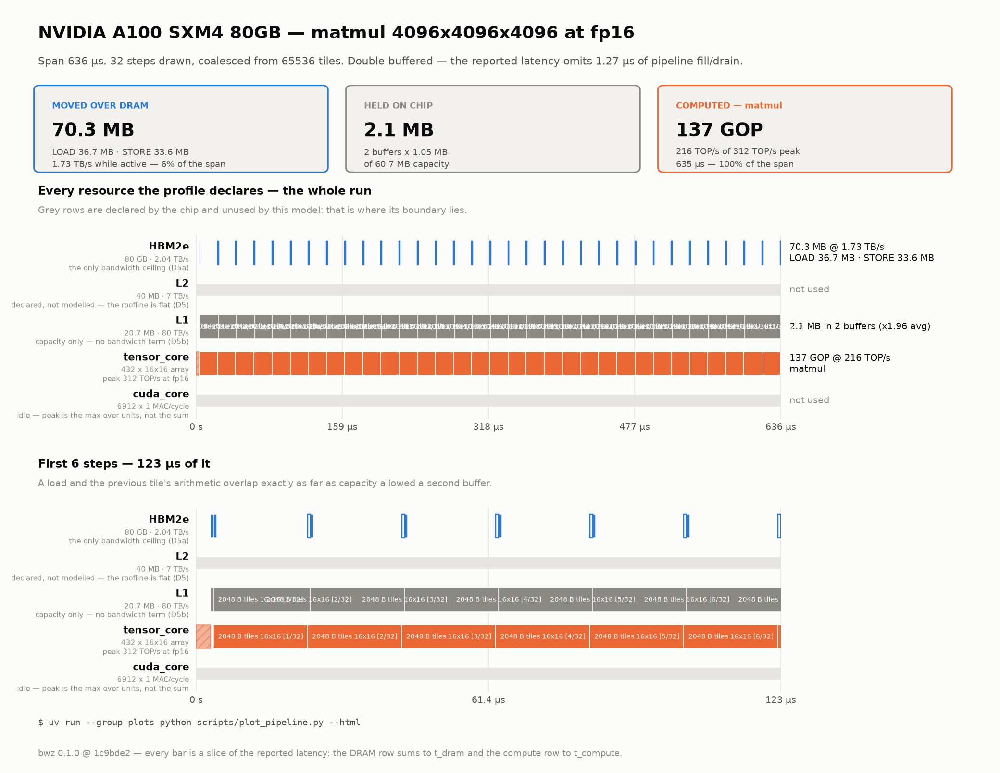

# The analytical model

Every formula the engine uses, with derivation and limits of validity.
Filled in milestone by milestone; the authoritative build spec is `PROMPT.md` §3.

To *run* any of this rather than read it, see [`CLI.md`](CLI.md), which carries the exact command
behind every figure quoted below.

## Status

| Section | Milestone | Status |
|---|---|---|
| Peak throughput and the ridge point | M1 | **implemented** |
| Parameter and KV-cache counts | M1 | **implemented** |
| FLOP/byte counts (transformer, CNN) | M2 | **implemented** |
| Roofline (flat: compute ridge vs DRAM ridge) | M3 | **implemented** |
| Roofline (hierarchical, multi-level) | M8, on demand | not yet implemented |
| Shape utilisation (rule of multiples) and wave occupancy | M3 | **implemented** |
| Tile grid from the chip's declared dataflow (`ws`/`os`/`is`/`rs`) | M3 | **implemented** |
| Loop-order *search* over dataflows | M8, on demand | not yet implemented |
| Multi-chip sharding and collectives | M5 | not yet implemented |
| Memory capacity planning and residency | M3 | **implemented** |
| Power/energy | M7 | not yet implemented |
| Bottleneck classification and flip margins | M3 | **implemented** |

## The v1 machine

Three elements, and no more (`docs/CORRECTIONS.md` D5a):

- **External memory (DRAM/HBM)** — the only bandwidth ceiling.
- **On-chip SRAM** — **capacity only**. It buys two things: the fraction of weights that need not
  be re-streamed from DRAM, and the headroom that makes double buffering possible. It contributes
  no bandwidth term. D5b records why, and what a published SRAM organization would let us add.
- **Compute** — the TOPS ceiling.

The multi-level hierarchy, the ws/os/rs loop-order search and Winograd/FFT are deferred to M8
(D5).

---

## 1. Peak throughput (M1, `spec/hardware_spec.py`)

A compute unit is described by its MAC rate; operations are twice that. **The doubling happens in
`ComputeUnit.peak_flops_per_s` and nowhere else in the codebase** (CLAUDE.md #5):

```
peak_ops_per_s = count x macs_per_cycle_per_unit x clock_hz x dtype_multiplier
                       x sparsity_speedup x 2
```

A chip's peak is the **max** over its compute units, not the sum: a GEMM runs on the tensor cores
or on the vector cores, not both at once, and vendor headline figures quote the dominant unit.

Worked examples, each pinned by a golden test:

| chip | derivation | peak |
|---|---|---|
| H100 SXM5 fp16 | `528 x 512 x 1.83e9 x 2` | 989.4 TFLOP/s |
| A100 80GB fp16 | `432 x 256 x 1.41e9 x 2` | 312.0 TFLOP/s |
| MI300X fp16 | `304 x 1024 x 2.1e9 x 2` | 1307.4 TFLOP/s |
| Jetson Orin fp16 | `64 x 256 x 1.3e9 x 2` | 42.6 TFLOP/s |
| chip_a int8 | `4 x 262144 x 0.8e9 x 0.125 x 2` | 209.7 TOP/s |

`chip_a`'s 0.125 multiplier is a bit-serial INT8 datapath taking 8 cycles per MAC. Expressing it
as a dtype multiplier rather than a divided clock keeps the MAC count architectural and the
doubling in one place.

### The ridge point

```
ridge_point = peak_ops_per_s / dram_bandwidth_bytes_per_s      [ops/byte]
```

An operation whose arithmetic intensity is below the ridge is DRAM-bound; above it,
compute-bound. `chip_a`: `209.6e12 / 34e9 = 6165` ops/byte. `chip_b`: `52.4e12 / 34e9 = 1541`.
Both are enormous, which is the whole story of batch-1 decode: at an intensity of 2 ops/byte
(one MAC pair per INT8 weight byte) you are three orders of magnitude to the left of the ridge,
and nothing about the compute array matters.

---

## 2. Parameter counts (M1, `spec/model_spec.py`)

Derived closed-form from the hyperparameters, independently of the graph. M2's builder sums its
weight tensors and cross-checks against this — two independent derivations agreeing is a stronger
test than either alone.

```
q_width    = heads    x head_dim         # NOT hidden, when head_dim is explicit
kv_width   = kv_heads x head_dim         # GQA: kv_heads < heads

attn/layer = hidden x q_width + 2 x hidden x kv_width + q_width x hidden
ffn/layer  = n_matrices x hidden x ffn_hidden      # 3 for swiglu/geglu, 2 for gelu/relu
norm/layer = 2 x (hidden for rmsnorm, 2 x hidden for layernorm)

embeddings = vocab x hidden, doubled unless tie_embeddings
params     = layers x (attn + ffn + norm) + embeddings + final_norm
```

Worked example (Llama-3-8B): attention `4096x4096 + 2x4096x1024 + 4096x4096 = 41.94 M`; FFN
`3 x 4096 x 14336 = 176.16 M`; norms `2 x 4096`. Per layer 218.11 M, times 32 layers = 6.980 G.
Untied embeddings `2 x 128256 x 4096 = 1.051 G`. **Total 8.030 G**, against Meta's stated 8.03 B.

The `q_width != hidden` case is not a curiosity: Gemma-3-4B has 8 heads of 256 against a hidden
of 2560, so `q_width = 2048`. Assuming `q_width == hidden` would overstate its attention weights
by 25%.

### KV cache

```
kv_bytes(C) = layers x 2 x kv_width x C x bytes_per_element x batch
```

The 2 is K and V. Worked example (Llama-3-8B, 8k context, fp16, batch 1):
`32 x 2 x 1024 x 8192 x 2 = 1.0737e9` bytes — exactly 1.0 GiB, or 1.07 GB in the decimal
convention this engine uses throughout. GQA is what makes this affordable: with 32 KV heads
instead of 8 it would be 4.3 GB.

---

## 3. Operator cost models (M2, `operators/`)

Each model reports the arithmetic an operation performs and its **compulsory** traffic — every
weight read once, every input read once, every output written once. Nothing here knows about a
chip: cache reuse and shape utilisation are `analysis/`'s job (`docs/CORRECTIONS.md` D10),
and tile re-reads are not modelled at all in v1 (§6.2). That is what makes every number below checkable with a calculator.

`OpCost` splits bytes by role because M3 treats them differently — weight traffic is what
residency removes, activation traffic is what tiling affects, and `scratch` is what
FlashAttention eliminates.

### 3.1 Matmul

```
flops        = 2 · M · N · K
weight_bytes = K · N · sizeof(w_dtype)
input_bytes  = M · K · sizeof(a_dtype)
output_bytes = M · N · sizeof(a_dtype)
```

`M` folds batch and sequence: `batch·S` at prefill, `batch` at decode. That one number is the
difference between the two regimes. Llama-3-8B's Q projection at batch 1 is `M=1, K=N=4096`:
33.55 MFLOP against 33.55 MB of fp16 weights — **1 FLOP per byte**, against a ridge point of 295
on H100. Nothing about the compute array matters at that intensity.

### 3.2 Attention

```
positions = q_len · kv_len,  or the causal lower triangle when q_len > 1:
            q_len · (kv_len − q_len) + q_len · (q_len + 1)/2
scored    = batch · heads · positions
flops     = 2 · 2 · scored · head_dim  +  5 · scored
```

Three properties the tests assert directly:

- **Causal masking halves prefill scores.** The exact triangular fraction is used, not a flat 0.5,
  so short prompts and prompts appended to existing context are both right. At decode `q_len = 1`
  and every key is visible, so nothing is halved. PROMPT.md's `4·d_model·S²` omits this.
- **GQA changes bytes, never FLOPs.** All `heads` query heads participate in every score; only
  `kv_heads` distinct K/V heads are read.
- **FlashAttention changes bytes, never FLOPs.** Vanilla writes the `q_len × kv_len` score matrix
  and reads it back (`scratch_bytes = 2 · scored · sizeof(a_dtype)`); flash tiles it in registers.

Worked example (Llama-3-8B prefill, S=2048, batch 1, 32 heads, head_dim 128): positions
`2048·2049/2 = 2 098 176`, scored `67 141 632`, so `4 · scored · 128 = 34.38 GFLOP` plus
`5 · scored = 0.34 GFLOP` — **34.71 GFLOP**.

### 3.3 Norm, elementwise, embedding

`flops = elements × flops_per_element`, with the per-element counts in `calibration.py` as
declared conventions (RMSNorm 4, LayerNorm 6, softmax 5 per score, SiLU 4, GELU 8, RoPE 3). None
of them changes a bottleneck verdict; all of them are memory-bound at intensity ≈ 1.

**Embedding is a gather, and this matters.** Only the rows touched are traffic; the table is
footprint. Charging the table would add 1.05 GB of phantom traffic to every Llama-3-8B decode step
and roughly double its predicted latency.

### 3.4 Convolution

```
flops = 2 · batch · out_h · out_w · out_channels · (in_channels / groups) · kernel_h · kernel_w
```

im2col shares this model — same arithmetic, different layout. Winograd and FFT genuinely reduce
the arithmetic and are M8.

**Depthwise** sets `groups = in_channels = out_channels`, collapsing the `in_channels/groups`
factor to 1: FLOPs fall by the channel count while activation traffic is unchanged, so arithmetic
intensity falls by the same factor. That is why MobileNetV3's depthwise layers are memory-bound.

---

## 4. Transformer expansion (M2, `graph/transformer.py`)

Prefill and decode are built as **separate graphs**, not one graph with a flag (CLAUDE.md #6).
Same weights, same op count, same structure; the only difference is `M` and the KV wiring:

| | prefill | decode |
|---|---|---|
| `M` (projection rows) | `batch · S` | `batch` |
| `q_len` / `kv_len` | `S` / `S` | `1` / context |
| KV traffic | K/V just computed, written as the cache | the whole cache streamed |
| arithmetic intensity (Llama-3-8B) | **744** FLOP/byte | **1.06** FLOP/byte |

Per block: norm → Q/K/V projections → RoPE → attention → O projection → residual → norm → FFN
(gate/up/down for a gated FFN, up/down otherwise) → residual. Around them: an embedding gather,
a final norm, and the LM head.

Two modelling choices worth stating:

- **The LM head runs on the last token only**, in both phases. Inference needs one distribution per
  *generated* token, and every serving stack slices before the projection. Computing all `S` would
  add `2·S·hidden·vocab` — for Gemma-3-4B at S=2048 that is 2.7 TFLOP against a 13.7 TFLOP forward
  pass, a 20% error.
- **Tied embeddings are one tensor**, so the LM head reuses `embed_tokens` and the footprint counts
  it once.

### The analytic FLOP rules, and where they stop working

Prefill is forward-only, so the rule is **`2·N·D`** — `6·N·D` is the *training* figure and
PROMPT.md's M2 DoD states it in error (`docs/CORRECTIONS.md` D11). But `2·N·D` assumes every
parameter does two FLOPs per token, and embedding parameters do not — they are gathered, and the
head runs once:

| model | embeddings as % of N | vs `2·N·D` | vs `2·N_non-emb·D` |
|---|---|---|---|
| GPT-3 175B | 0.4% | **+1.1%** | +1.4% |
| Llama-3-8B | 13.1% | −9.7% | +3.9% |
| Gemma-3-4B | 17.3% | −13.5% | +4.5% |

The general form is `2·N_non-embedding·D`, and the residual above it is attention, which grows as
`D²` — Gemma-3-4B is +1.2% over that form at S=512 and +4.5% at S=2048. Quote either rule with its
context length and its embedding share, or not at all.

---

## 5. CNN expansion (M2, `graph/cnn.py`)

Channel propagation is the whole job: layer *n*'s weight shape depends on layer *n−1*'s output
channels, which is why `CNNSpec.parameter_count()` raises and defers to the graph. Spatial extents
follow `ceil(extent / stride)` ('same' padding).

An MBConv block expands 1×1, convolves depthwise `k×k`, optionally squeeze-excites, and projects
1×1, with a residual when stride is 1 and channels are unchanged. **The expansion is omitted when
`expand_channels == in_channels`** — MobileNetV3's first block expands 16→16, and the reference
implementation skips it rather than emitting an identity 1×1.

MobileNetV3-Large 1.0 at 224², batch 1: **5.47 M parameters** (paper: 5.4 M, +1.3% — batch-norm
pairs and SE bottlenecks, which the headline figure does not itemise) and **234.8 M MACs**
(paper: 219 M, +7.2%). Every convolution in the network sits below 65 FLOP/byte against H100's
ridge of 295 and chip_a's of 6168, so the whole network is memory-bound on either.


---

## 5b. Matmul expansion (`graph/matmul.py`)

The smallest workload the engine expresses: one `A[M,K] × B[K,N] → C[M,N]`, three tensors, no
network around it. Its purpose is to interrogate the *machine* — where the ridge point falls, what
the shape padding costs, which decomposition the chip's dataflow implies, what `--ideal` does and
does not change — with nothing else present to explain a number away. `M` folds batch in, as everywhere else.

It speaks matmul, not transformer: operands `A` and `B` and a result `C`, each with its own width,
and `deployment.precision` is ignored entirely (`docs/CORRECTIONS.md` D18). It is a family rather
than a hand-costed `custom` op because a `CustomOp` carries no shape, so shape utilisation would
silently come back as 100% (D17).

**Widths.** The arithmetic runs at the **wider operand** — both enter the array through one
datapath — and the result width is an **accumulator** width that changes bytes only, never
operations:

| A | B | C | operations | compulsory bytes | runs at |
|---|---|---|---|---|---|
| int8 | int8 | int8 | 137.4 GOP | 50.3 MB | int8, 624 TOP/s |
| int8 | int8 | int32 | 137.4 GOP | 100.7 MB | int8, 624 TOP/s |
| fp16 | fp16 | fp16 | 137.4 GOP | 100.7 MB | fp16, 312 TFLOP/s |
| fp16 | int8 | fp16 | 137.4 GOP | 83.9 MB | **fp16**, 312 TFLOP/s |

M=N=K=4096 throughout. The last row is the one that catches people: halving B's width saves 16.8 MB
and not one nanosecond of arithmetic.

**Shape.** A100, fp16, `--ideal`, three shapes — the same chip, three different machines:

| M | intensity | shape util | verdict | latency |
|---|---|---|---|---|
| 10000 | 3333 OP/byte | 99.91% | compute-bound by 21.8× | 6.42 ms |
| 512 | 464 OP/byte | 98.50% | compute-bound by 3.8× | 333 µs |
| 1 | 1.0 OP/byte | **4.52%** | DRAM-bound by 4.8× | 68.3 µs |

`N = K = 10000` throughout. The last row is the whole point: the arithmetic fell by 10000× but the
traffic did not fall at all. Its 4.52% is two losses multiplied, and separating them is worth doing
by hand — a 16-row instruction tile running one row wastes fifteen of them (`1/16 = 6.25%`), and the
625 output tiles that remain take two waves over 432 tensor cores whose second is 45% full
(`625/(2·432) = 0.723`). `6.25% × 0.723 = 4.52%`. The first number is the array's geometry; the
second is how much of the *chip* the work could reach.

**Traffic is compulsory traffic, split by direction.** Each operand is charged once — the traffic
of a perfectly tiled schedule that reads every byte exactly once — and reads and writes are charged
separately, because they are not interchangeable:

```
read  = (1-r)·weight + (1-r_a)·(input + scratch)
write = terminal_output + (1-r_a)·consumed_output
```

`terminal_output` is the share of the result that no later operation reads. For a standalone matmul
that is all of `C`: it is the answer, so it must reach DRAM whatever the capacity, and discounting
it by activation residency understated traffic (`docs/CORRECTIONS.md` D22). For a transformer's
intermediate activation it is zero — the next operator consumes it on chip.

The sharpest case: a 4096³ INT8 matmul on chip_a fetches **nothing** (55 MB of SRAM holds all of
B) and still writes 16.8 MB.

Re-reads forced by a working set that does not fit on chip are **not** modelled; see §6.2. For a
matmul that does not fit, the reported DRAM traffic is therefore a lower bound, and the reported
latency with it.

`make plots` places these on the chip's roofline:
[`plots/roofline-a100_80gb-fp16.png`](plots/roofline-a100_80gb-fp16.png). The figure plots
intensity against **DRAM** traffic rather than compulsory traffic, so residency moves a point to
the right and a fully resident workload leaves the chart entirely — which is what
[`plots/roofline-chip_a-int8.png`](plots/roofline-chip_a-int8.png) shows for a 4096³ matmul on
55 MB of SRAM.

---

## 6. Single-chip analysis (M3, `analysis/`)

### 6.1 Shape utilisation — the rule of multiples

```
MMA unit:  utilisation = [K / padded(K, rows)] · [N / padded(N, cols)] · [M / padded(M, rows)]
crossbar:  utilisation = [K / (padded(K, rows) + 1)] · [N / padded(N, cols)] · [M / padded(M, rows)]
```

An array processes fixed `rows × cols` tiles, so a dimension that is not a multiple of the tile is
padded with zeros and the array computes them anyway. Utilisation is the fraction of each padded
dimension that carries real work, over `ceil(K/rows) · ceil(N/cols)` tiles. `padded()` rounds the
**dimension**, never the tile count, so the result is bounded by 1 (CLAUDE.md gotchas).

**Which branch an array takes is physical (D34, D52).** An **MMA unit** — a tensor or matrix core,
any unit whose dtype multiplier is ≥ 1 — issues fixed instruction tiles (Ampere `.f16`: `m8n8k4`,
`m16n8k8`, `m16n8k16`; [PTX ISA §9.7.15][ptx]). This covers AMD as well as NVIDIA: CDNA Matrix
Cores issue fixed-shape `MxNxK` [MFMA][mfma] instructions, so `mi300x` takes this branch for the
same reason `a100_80gb` does. M and N slice into *independent* output tiles that
different cores compute in parallel, so **M is a spatial dimension, not a time one**: there is no
serial pipeline to fill, and every axis is plain padding. A **bit-serial crossbar** — multiplier
below 1, such as the Metis D-IMC at INT8 (0.125) — is likewise combinational on M, but its
sub-cycle stream rides K with one sub-cycle row of fill: `K·s / (K_pad·s + s) = K/(K_pad + 1)`.
Neither branch has an M-serial pipeline; they differ only on K.

[ptx]: https://docs.nvidia.com/cuda/parallel-thread-execution/index.html
[mfma]: https://rocm.blogs.amd.com/software-tools-optimization/matrix-cores/README.html

| case | MMA unit | bit-serial crossbar |
|---|---|---|
| M=1 on 128×128 (CLAUDE.md's check) | **1/128** | ≈ 1/128 |
| M=1 on 512×512 (chip_a, chip_b, Metis) | **1/512** | ≈ **1/513** |
| M=512 on 512×512 | **1.0** | ≈ 1.0 |
| M=2048 on 512×512 | **1.0** | ≈ 0.998 |

Until D52 the MMA branch instead charged `M/(M+rows)`, a rows-deep pipeline fill borrowed from a
conventional systolic pump. No chip in `profiles/chips/` is such a pump — every non-bit-serial unit
is a 16×16 MMA core (A100, H100, Orin, MI300X) — so that term modelled hardware the project does
not ship, and understated mid-M utilisation by up to 2× (M=16 read 50%, not 100%).

This is the largest single correction the engine applies, and it is separate from — and
multiplicative with — the achieved-throughput derating in `calibration.py`. See D14 for what it
does to the D8 conclusions.

#### The tile grid — which dimensions are cut, and by what (D53)

The three padding terms above describe how each dimension fits an array-sized tile, which is true
whichever operand stays resident. **How many tiles there are** is not: that follows from the chip's
**stationarity**, and `analysis/stationarity.py` is the single place that decides it. For a matmul
the operands map as **input = A, weight = B, output = C**.

| stationarity | resident | parallel grid | swept per tile | partials cross cores | partials reach DRAM |
|---|---|---|---|---|---|
| `os` output-stationary | C (accumulator) | `ceil(M/rows) × ceil(N/cols)` | K | no | no |
| `os` + `--split-k p` | C | that grid, `× p` | K/p | yes | **yes** |
| `ws` weight-stationary | B tile | `ceil(K/rows) × ceil(N/cols)` | M | yes | no |
| `is` input-stationary | A tile | `ceil(M/rows) × ceil(K/rows)` | N | yes | no |
| `rs` row-stationary | one A row per PE | `ceil(M/rows) × ceil(N/cols)` | K, spread spatially | local to the array | no |

`os` is what cuBLAS and CUTLASS do — K accumulates in registers inside one output tile — and is the
**native** dataflow of `a100_80gb`, `h100_sxm`, `jetson_orin` and `mi300x`. All four also *declare*
`ws` and `is` (D62), not because a vendor runs a GEMM either way but so that the other two
decompositions can be measured against `os` on the same silicon; the native choice, and every
default, is unchanged. `metis_aipu`, `chip_a` and `chip_b` declare `ws`: their weights *are* their
memory, so an accumulator-resident dataflow is not something they could run. `rs` is defined for
completeness after Eyeriss (Chen/Emer/Sze, ISCA 2016) and no profile declares it, so its numbers are
labelled unvalidated in `report.assumptions`.

"Weight-stationary" on a unit that holds no weights is a **misnomer**, and the report says so rather
than repeating it: an MMA unit reads every operand from the register file per instruction (D30), so
what `ws` changed there is the *grid* — its rows are slices of K — and that is what costs.

`DeploymentSpec.stationarity` (`--stationarity`) selects; a chip that cannot run the choice is
**refused** with `feasible: false`, not clamped, because a clamp would silently answer a different
question. **Every grid issues the same `M·N·K` MACs** — they differ only in quantisation loss,
in which operand each staging event covers, and in whether partial sums are owed.

#### Wave occupancy — how many of the chip's arrays the work can reach

The terms above describe **one** array. A chip declares `count` of them, and `peak_flops_per_s`
multiplies by `count`, which assumes every array always has a tile. A fourth term charges the times
it does not (D30):

```
tiles      = operation_tiles(op, unit)         [the grid above, per stationarity]
waves      = ceil(tiles / units)
occupancy  = tiles / (waves · units)
used       = min(units, tiles)                 [arrays that ever get one]
```

`operation_tiles` is the grid's own tile count for a matmul or a convolution, and `batch × heads`
times one head's grid for attention, whose heads are separate GEMMs that fill the arrays alongside
each other.

`used` is a different question from occupancy and the figures ask it: occupancy averages over the
run, so 0.5% could mean one array busy or all 432 half-busy. A resource row has to say which, and
it is the same `min(count, tiles)` the emitted program calls `USED_CORES`.

| case | tiles / units | occupancy |
|---|---|---|
| 100³ on Metis, `ws` (4 AI cores) | 1 / 4 | **0.25** — one core works, three idle |
| 100³ on A100, `os` (432 tensor cores) | 49 / 432 | **0.113** |
| 600³ on Metis, `ws` | 4 / 4 | 1.00 |
| 4096³ on A100, `os` | 65536 / 432 | 0.998 |
| M=1, N=K=10000 on A100, `os` | 625 / 432 | **0.723** — 2 waves, the second 45% full |
| the same under `ws` | 390625 / 432 | 0.999 — but 390 625 partial sums to reduce |

**Which tiles share a wave is itself a decision (D68).** The default deal is round-robin —
consecutive tiles to consecutive arrays, `units` at a time, across grid-row boundaries — and the
formula above is its occupancy. A unit that sums K in its own periphery (`LOCAL` below) cannot use
it: the k-slices of one output column must all run on the *same* array or their partials have
nowhere to meet. So for such a unit a wave never straddles a grid row, and array `u` keeps column
`round · used + u` for every k-slice:

```
used       = min(units, grid_cols)
waves      = grid_rows · ceil(grid_cols / used)
occupancy  = tiles / (waves · units)
```

| case (Metis, 4 cores) | grid K × N | round-robin | column-per-unit (D68) |
|---|---|---|---|
| N = K = 2048 | 4 × 4 | 4 waves, 1.00 | 4 waves, **1.00** — the same; 4 columns divide 4 cores |
| N = 1024, K = 4096 | 8 × 2 | 4 waves, 1.00 | 8 waves, **0.50** — 2 cores |
| N = 512, K = 8192 | 16 × 1 | 4 waves, 1.00 | 16 waves, **0.25** — 1 core |
| N = 2560, K = 1024 | 2 × 5 | 3 waves, 0.83 | 4 waves, **0.625** — rows split 4 + 1 |

The round-robin figures in the last three rows were the model's before D68, and they were wrong in
the direction that flatters: full occupancy bought by splitting a column over cores whose partials
were then "summed locally" in four different peripheries. `analysis/stationarity.py` decides the
deal (`deal_for`), and the utilisation, the trace and the emitted program all read it.

**K-groups: sharing a column's K without losing the local sum (D69).** The column-per-unit column
above is right only for a chip with nothing to add partials off the array (`chip_a`). A chip with a
vector unit (Metis's DPU) does better with idle arrays: `g` arrays share each column, each keeps one
**group** of its k-slices — every `g`-th, `kt mod g = group` — and sums it in its own periphery for
free, as in D68. Only the `g` group partials per output leave their arrays, so the vector unit adds
`(g − 1)·M·N`, not the `(p − 1)·M·N` a round-robin spread of `p` slices would send. Two reasons set
`g`, and the larger wins:

```
g_depth     = ceil(k_slices / floor(depth / tile_rows))    [Metis: 32 slices per accumulator]
g_occupancy = floor(units / grid_cols)   if grid_cols < units and the chip has a vector unit, else 1
g           = min(k_slices, max(g_depth, g_occupancy))
waves       = ceil(grid_rows / g) blocks · ceil(g · grid_cols / used)
```

Each wave is a block of `g` grid rows, so waves stay contiguous tile ranges and array `u` keeps the
same (group, column) item in every block.

| case (Metis, 4 cores) | g | occupancy | DPU adds (hidden under the matrix work) |
|---|---|---|---|
| N = K = 2048 | 1 | 1.00 | 0 — `LOCAL` |
| N = 1024, K = 4096 | 2 (occupancy) | 1.00 | `1 · M · N` |
| N = 512, K = 8192 | 4 (occupancy) | 1.00 | `3 · M · N` — 786,432 at M = 512, 1.92 µs vs 20.5 µs |
| N = 2048, K = 32768 | 2 (depth) | 1.00 | `1 · M · N`, where round-robin charged `63 · M · N` |

The placement for `g > 1` is `ON_CHIP` (or `DRAM` past capacity) with `p = g`; the group partials'
L1/L2 traffic is not charged (no on-chip bandwidth term, D5b), and the DPU's rate is the profile's
estimate. Splitting one matmul's K across AI cores is the model's choice: the paper states only that
the cores can jointly tackle a workload. Convolutions whose k-slices are grouped are charged the same
way; a convolution spread across MMA units without grouping is not charged a reduction at all, a
gap that predates D69.

Negligible on a large GEMM by construction and dominant on a small one, which is why the aggregate
peak alone cannot compare two chips on anything small. The last two rows are the one place where a
*more* accurate decomposition reports a *lower* number: `ws` claimed parallelism that only existed
because every tile held a partial sum needing a reduction the model did not then charge (D53). It
does now — see the placement table below — so the trade those two rows describe is priced rather
than merely noted: `ws` buys the occupancy and pays the vector unit for it.

#### The reduction, and where its partials meet (D62)

Partial sums exist wherever K is cut across tiles: `p` slices leave `p` partial values for every
output element, `p = ceil(K/rows)` when K is on the grid and `p = k_partitions` under split-K. What
they *cost* is decided by **where they can meet**, which is a property of the hardware rather than
of the dataflow's name. `ReductionPlacement` is that choice:

| placement | when | vector adds | DRAM bytes | dispatches | how it combines |
|---|---|---|---|---|---|
| `NONE` | K is not cut (`os`, `rs`) | 0 | 0 | 0 | — |
| `LOCAL` | K on the grid's **row** axis, `K ≤ local_accumulation_inputs`, a column's k-slices dealt to one unit (D68), and one K-group (D69) | 0 | 0 | 0 | — |
| `ON_CHIP` | K on the grid, `M·N·acc_bytes` fits on chip — `p` partials per output: one per k-slice, or one per K-group (D69) | `(p−1)·M·N` | 0 | 0 | **`max(matrix, vector)`** |
| `DRAM` | split-K, **or** an accumulator too big to hold | `(p−1)·M·N` | `2·p·M·N·acc_bytes` | 1 | `matrix + vector` |

- **`LOCAL`** is a *declared* capability, not an assumption about the dataflow. Metis's `d_imc`
  declares `local_accumulation_inputs: 16384` — ISSCC 2024 11.3 Fig. 11.3.1, *"local accumulation up
  to 16k input channels"*, and the paper states the mechanism: an integer arithmetic unit sums a
  large MVM's partial products *"without storing intermediate results back to memory"*. The
  accumulation happens in one AI core's periphery and never reaches L1 — which is why the deal
  above keeps a column on one core, and why `is`, whose K is the grid's column axis, never
  qualifies: a wave spreads a row's k-slices across units. Every documented Metis
  figure is at K = 8192, half that depth, so it costs nothing; K = 32768 flips to `ON_CHIP` and the
  DPU pays. A unit whose **native** dataflow already carries K on the grid but declares no depth
  keeps the model's older, unbounded claim — that is what `chip_a` and `chip_b` rest on, and the
  drawer says it is unfalsifiable as it stands.
- **`ON_CHIP`** is the tensor-core case. An MMA unit's accumulator lives in one threadblock's
  registers, so k-slices landing on different SMs have nothing to meet in: the partials go out to
  the last-level cache and the **vector** unit adds them (`t_reduce_s`; a matrix engine does MAC and
  nothing else, D27). Those adds **overlap** the matrix work — the array builds slice *n+1* while
  the CUDA cores sum slice *n* — so compute is `max(t_matrix, t_vector)`, steady state only, exactly
  as `max(t_dram, t_compute)` omits fill and drain a level up (D19). Synchronisation between the two
  engines is **not** charged, and neither is the cache traffic: v1 has no on-chip bandwidth term
  (D5a/D5b). Both are named in `report.assumptions`.
- **`DRAM`** is split-K — genuinely two kernels, CUTLASS's *"partitionedK GEMM, and batched
  reduction"* — or a K-on-grid walk whose `M × N` accumulator does not fit on chip. Charged in full:
  `p · M · N · acc_bytes` written and read (`OpResult.dram_reduction_bytes`, kept out of the
  operands' read/write totals), the adds serialised behind the arithmetic, and one extra dispatch.
  The capacity case is a **cliff**: one output element less and the same decomposition would have
  been `ON_CHIP`, so the report says the placement flipped rather than merely reporting a bigger
  number. It is also an upper bound — a real compiler re-blocks the output and re-reads A and B
  instead, traffic §6.2 already declines to model.

The additions are **not new arithmetic**: `(K/p − 1)·p + (p − 1) = K − 1` for every `p`, so `2·M·N·K`
already counts them. What a cut K changes is that `(p−1)·M·N` of them leave the matrix engine's
accumulator for a unit 16× slower, and the sliver this double-counts is the same count at the matrix
rate — 1/16 of what it adds on A100.

**Worked example, A100 fp16 at 4096³.** `ws` cuts K into `4096/16 = 256` slices, so the CUDA cores
owe `255 · 4096 · 4096 = 4.28 G` additions at 19.5 TOP/s (ideal) = 219 µs, against 442 µs of matrix
work. The ratio is not a coincidence and does not depend on the shape: the CUDA cores are 16× slower
at `2 · rows = 32×` less work, so vector time tends to half matrix time on this array at any large
K. The overlap therefore hides it entirely and `ws` reports the *same latency* as `os` — what it
really costs is 16.8 M live accumulators. At 8192 × 8192 those stop fitting: the placement flips and
the same decomposition costs 39.8 ms against `os`'s 2.52 ms. That is the finding, and it is a capacity
finding, not a throughput one.

A K-on-grid stationarity is **refused** (`feasible: false`) at a dtype whose fastest non-systolic
unit does not exist — A100 at int8, where `machine.vector_unit` falls back to the tensor core
itself. Charging elementwise adds at 437 TOP/s would price the decomposition as nearly free, which
is the opposite of the truth. `--split-k` on a grid that already carries K is refused for the same
reason a clamp is not offered: cutting the contraction twice is incoherent (D53).

### 6.1a Weight residency in the array itself

A systolic array that stores no weights — an NVIDIA tensor core reads every operand from the
register file — has no residency limit of its own. A **digital in-memory-compute** array does: a
weight cannot join a MAC until it has been written into a bank. `ComputeUnit.weight_sets` records
how many array-sized tiles one unit holds, and `resident_tile_capacity() = count × weight_sets` how
many the chip holds.

Metis declares 4 weight sets across 4 AI cores: **16 tiles resident, 4 computing.** An operation
needing more must re-write the arrays as it runs — a 4096³ INT8 matmul is 64 tiles, so 48 reloads.
The **capacity** is modelled and reported; the **time** for those reloads is not, because charging
it needs a bandwidth on the L1→IMC path and v1 has no on-chip bandwidth term (D5a, D5b, D30). The
assumptions drawer says so on every report.

**The reloads still have a schedule (D33).** The sets are independently addressed, so the deploy
listing writes each reload a full wave ahead of its compute — `(w + 1) % WEIGHT_SETS`, into the set
freed three waves earlier — and the first wave's sets fill during the first A staging event. The
write therefore hides behind arithmetic rather than serialising in front of it; what the model
cannot yet charge is the bus time of that write itself.

### 6.2 Capacity planning and residency

On-chip capacity is allocated where it removes the most DRAM traffic (D15): the double buffer
first, then the activation working set, then weights. What is left over as a share of `W` is the
**residency fraction** `r`, and it is the only way SRAM enters the timing model.

Feasibility is `weights + KV + peak activations ≤ usable DRAM`. A failure returns a `Report` with
`feasible: false` and fixes ordered by what the user gives up — precision, then context, then
batch, then hardware — each naming the number it would have to reach.

**Nothing is pinned on chip.** `r` is not a claim that some weights stay resident for the whole
run while the rest are re-fetched every time; it is the fraction of `W` that a schedule need not
stream from DRAM more than once. Everything else streams, tile by tile, and that is what double
buffering overlaps.

**What is *not* modelled: tile re-reads.** The traffic charged is compulsory traffic — each operand
crossing DRAM exactly once — which is the traffic of an ideal tiled schedule, and a **lower bound**
on what a real one moves. The communication-optimal blocked matmul over a fast memory holding `M`
elements moves

```
Q >= 2·N³ / sqrt(M)        elements, for an N³ matmul     [Hong & Kung]
```

against a compulsory `3·N²`. The bound only bites once it exceeds compulsory traffic, which is
where the operands stop fitting — a square tile of side `sqrt(M/3)` is the largest holding all
three:

| case | tile side | compulsory | tiled bound | ratio |
|---|---|---|---|---|
| chip_a, int8, N=4096 | 4282 | 50.3 MB | 18.5 MB | **1.0x — fits entirely** |
| chip_a, int8, N=8192 | 4282 | 201 MB | 148 MB | 1.0x — bound not binding |
| chip_a, int8, N=16384 | 4282 | 805 MB | 1.19 GB | **1.47×** |
| A100, fp16, N=16384 | 3181 | 1.61 GB | 3.19 GB | **1.98×** |

So the engine is exact while the working set fits — which covers every transformer projection in
the shipped profiles, since `K×N` is at most a few hundred MB — and optimistic beyond it, by a
factor that grows as `N/sqrt(M)`. Adding the re-read term is the natural next step for `analysis/`;
it is out of v1 because it changes every DRAM-bound number in the repo and wants a measurement to
sit against (`docs/PLAN.md` Session 5).

### 6.3 The per-operation roofline

```
dram_bytes = (1 − r)·weight_bytes + (1 − a)·(input + output + scratch)
t_dram     = dram_bytes / (dram_bandwidth · bandwidth_efficiency)
t_compute  = flops / (peak_flops · achieved_fraction · shape_utilisation)
t_fixed    = per_op_overhead, for dispatched operations only
latency    = max(t_dram, t_compute) + t_fixed     [double buffering fits]
           = t_dram + t_compute      + t_fixed     [otherwise]
bound      = argmax of the three
```

`bound` is an argmax rather than a majority vote, so it answers "what do I change to make this
faster". Norms and elementwise ops are assumed fused and pay no dispatch: charging all 451 graph
nodes would triple a decode step's fixed cost.

**`a` is an inter-operation property, not an SRAM budget (D33).** A tensor some *other* operation
reads can stay on chip between the two, and `a` measures that. A tensor no operation reads — the
activation of a lone matmul, which is every matmul benchmark the figures show — cannot: one
staging event feeds it to every tile of its grid row and it is never touched
again, so it is compulsory traffic read exactly once, `a = 0`. The report says so in its
assumptions; `plan_memory` still computes the D15 fraction for multi-op graphs, and the two agree
there.

### 6.3a A's residency and B's write timing, as command-line strategies

D33 fixed the single-matmul roofline to charge A as compulsory traffic — one crossing, always.
`a_strategy` and `b_dataflow` (`bwz matmul --a-strategy`, `--b-dataflow`) generalise that fix into
three named points each, one of which is D33's own default, so the defaults reproduce every
existing number exactly. The two knobs are physically different and are kept apart rather than
fused into one flag: A has reuse — every tile of one grid ROW reads the same staged slice, whatever
that row is a slice *of* (D53) — so *how often* that slice is re-staged is a byte-amount question. B has none: within one pass every
tile is fetched exactly once whatever the choice (D30), so the only thing left to choose is *when*
the write lands relative to compute.

**Scope.** Both knobs, like stationarity (§6.1), describe **one invocation**. The single exception is
`b_dataflow=persistent` with `iterations > 1`: that is a statement about the *next* invocations
finding B still written, and the only B term that crosses a call boundary. Within one call,
`write-ahead`, `on-demand` and `persistent` move identical bytes and report identical latency; they
differ only in where the write sits in the pipeline trace. Stationarity's "B is resident" is the
within-call idea — a tile holds its block for one sweep — and must not be read as persistence.

```
A_traffic = |A| · TILES_PER_GROUP / residency_tiles

stage   residency_tiles = TILES_PER_GROUP      (default) -> A_traffic = |A|,   one crossing
whole   residency_tiles = TILES_PER_GROUP      (same bytes as stage; only the timing ramps upfront)
stream  residency_tiles = 1                    -> A_traffic = |A| · TILES_PER_GROUP
```

`TILES_PER_GROUP` is the width of one grid row (`grid.cols`) — D33's `NTILES_PER_KS`, generalised
by D53 to grids whose rows are bands of M rather than slices of K. `residency_tiles` is how many of
those tiles one staging event serves before the next is fetched. `stage` and `whole` serve the
whole row per event — A crosses DRAM exactly once, the D33 result — and differ only in *when* those
events are scheduled: `stage` at each row boundary, `whole` all of them ramped in before wave 0.
`stream` serves one tile per event — the honest picture for a machine whose GEMMs genuinely re-read
operands — and re-reads A `TILES_PER_GROUP` times. `--a-residency-tiles` overrides the default with
any power-of-2 divisor of it; a value that is not one is clamped down to the largest that is
(CLAUDE.md #8), because there is no honest way to serve a fractional tile.

Measured on Metis 8192³ INT8, which is weight-stationary so a row is a k-slice
(`TILES_PER_GROUP = 16`, `|A| = 67.1 MB`):

| `a_strategy` | A bytes | A's DRAM time |
|---|---|---|
| `stage` (default) | 67.1 MB | 1.966 ms |
| `whole` | 67.1 MB | 1.966 ms, all before the first tile |
| `stream` | 1.07 GB | 31.46 ms |

B's write timing charges **no bytes at all** in a single pass — `write-ahead` (default, D33's
weight-set rotation), `on-demand` (exposed at compute) and `persistent` (loaded once) all write the
same total, because v1 has no on-chip write-bandwidth term to charge one placement more than
another (D5b, D30). The one place `b_dataflow` *does* move bytes is across **iterations**: a
`persistent` B that fits the array's resident tile capacity (`tiles <= units · weight_sets`) need
not be rewritten on a repeat invocation, so with `iterations = N > 1` the report charges the
amortised share `1/N` of one full write — the first invocation pays it, the other `N-1` pay nothing.
`analyze()` still returns one report, not `N`; `iterations` only ever reaches this one multiplier.

**`on-demand` does get real schedule timing (D40).** No bytes move, but *when* B's already-costed
DRAM load is allowed to overlap compute is a legitimate, zero-new-constant thing to model: the
double-buffered tile schedule (`analysis/pipeline.py`) ordinarily lets a wave's B load prefetch as
early as the port and buffer allow — that overlap *is* `write-ahead`'s definition. `on-demand`
removes it, forcing the load to wait for the previous wave's compute to finish, exposing the same
load duration on the critical path instead of hiding it. This changes the **drawn trace**
(`trace.total_s`/`fill_drain_s` grow, exactly like `--a-prefetch-depth 1` already does) and never
the **reported** `t_dram`/`t_compute`/`latency` — D19's asymmetry rule again: a trace may run slower
than the report it illustrates, never faster, and the report itself never moves. `persistent` gets
no schedule change: `write-ahead`'s existing overlap already achieves this model's best case (any
buffering depth beyond 2 is provably equivalent — swept empirically, and `docs/CLI.md` §2.5's own
`--a-prefetch-depth` example independently shows the same thing), so there is no byte-conserving
reordering that makes a single-pass `persistent` trace faster than `write-ahead`'s. Both placements
are gated on `weight_sets > 1` — a chip with no resident weight bank (`weight_sets = 1`, every
shipped GPU profile) has nothing to place ahead of, expose, or persist, and resolves either choice
straight back to `write-ahead`.

Both `whole` (scratchpad `>= |A|`) and `persistent` (`tiles <= units · weight_sets`) clamp rather
than raise when they do not fit, falling back to `stage`/`write-ahead` with the requested value, the
value used and why named in `report.assumptions` — never silently.

### 6.4 Schedule

A phase costs the sum of its operations. For a transformer the graph is a chain, so the sum *is*
the critical path; for a branching CNN it is conservative. The DAG longest-path machinery exists in
`graph/dag.py` and a real list scheduler with resource lanes is M6.

### 6.5 The tile schedule behind `max(load, compute)`

`analysis/pipeline.py` decomposes a phase's roofline numbers into the schedule they imply — which
resource is busy when — so the overlap can be *seen* rather than asserted. It adds no cost: the
spans on each lane sum back to `t_dram`, `t_compute` and `t_fixed`, which is the property its tests
assert.

A matmul's steps are its real tiles, and which tiles those are follows from the stationarity
(§6.1): `ceil(M/rows) · ceil(N/cols)` output tiles under `os`, `ceil(K/rows) · ceil(N/cols)` weight
tiles under `ws`. Either way it is the same grid §6.1 divides by, and each step loads
`t_dram/tiles` and computes `t_compute/tiles`. Two resources, each serial in itself, and
a buffer depth:

```
depth            = 2 if double buffered else 1
load_start(i)    = max(dram_free, store_end(i-depth))
compute_start(i) = max(load_end(i), compute_end(i-1))
store_start(i)   = max(compute_end(i), dram_free)
```

`store_end(i-depth)` is the buffer being *freed* — a buffer is occupied until its result has been
written out, not merely until the arithmetic ends. Drop that term and the schedule quietly assumes
infinite on-chip capacity, which is the thing capacity planning exists to prevent.

The one port carries both directions, and **the next tile's fetch outranks this tile's
write-back** — what a memory controller does with a write buffer. Drain stores first and the array
stalls behind them, which silently cancels the double buffer: it did, in the first version, and
SRAM occupancy fell from two buffers to one.

**What the schedule shows that the number hides.** Under double buffering it costs a load at the
head and a store at the tail that nothing overlaps, so `max(load, compute)` is the `tiles → ∞`
limit. The difference is reported as `PipelineTrace.fill_drain_s` — measured from the schedule
rather than derived from a formula, so it cannot drift away from the scheduler — and it is 1.27 µs
against 636 µs on a 4096³ fp16 matmul on A100 (0.2%). On a decode projection, which is a handful of
tiles rather than thousands, it is not small. Without a double buffer the span is
`t_dram + t_compute` exactly — there is nothing to hide when nothing overlaps.

**A network does not pipeline against itself.** For anything but a single matmul the trace lays
operations end to end, overlapping load and compute only *within* one, because that is the model's
own schedule (D5a). Its span therefore equals the reported latency exactly.

```
make plots        # docs/plots/timeline-<chip>-<dtype>.{png,html}
```

The `.html` is the same figure with a zoomable time axis, in one self-contained file
(`docs/plots/README.md`).

The figure's rows are **hardware resources** — every memory level and compute unit the profile
declares — with bytes, bandwidth and operations written on each, because that is the axis an
architecture comparison needs (`docs/CORRECTIONS.md` D20).



One figure per chip, because the schedule is a property of the machine: the same 4096³ matmul is
4% DRAM-busy on A100 and touches DRAM not at all on chip_a, whose 55 MB of SRAM holds all of `B`.

### 6.6 Flip margins

Every phase reports how far its binding term can move before the verdict changes, and whether that
input was flagged as an estimate. "DRAM-bound" with a 260× margin and "DRAM-bound" with a 6% margin
are different claims, and the label alone cannot distinguish them. This is what makes D5b's
deferred refinements safe to defer.

### 6.7 What the model reproduces

| check | source | result |
|---|---|---|
| Llama-3-8B fp16 decode, H100 | CLAUDE.md | DRAM_BW_BOUND, 16.1 GB/token, **165 tok/s** (see D12) |
| … utilisation at batch 1 | CLAUDE.md | **0.27%** |
| … prefill @2048 | CLAUDE.md | COMPUTE_BOUND, **67.3%** (target 40–70%) |
| … batch 128 decode | CLAUDE.md | COMPUTE_BOUND, 0.27% → **22%** |
| Gemma-3-4B batch 1, H100 | CLAUDE.md | 0.24% util; DRAM-bound, not latency-bound (D13) |
| MobileNetV3 on H100 | — | **LATENCY_BOUND**, the regime D13 describes |
| chip_a residency 4B/2B/1B | D8 | **1.40 / 2.73 / 5.71%** vs 1.4 / 2.7 / 5.5 |
| chip_b residency | D8 | **25.76 / 50.15 / 100%** vs 25.6 / 50 / 100 |
| chip_a decode | D8 | **8.4 / 16.8 / 37.0** tok/s vs 8.8 / 17.5 / 36 |
| chip_a TTFT @512 | D8 | **114.6 ms** vs 113; 1B **27.2** vs 27.9 |
| ridge points | D8 | **6165 / 1541** OP/byte |
| chip_b decode | D8 | **9.3 tok/s COMPUTE_BOUND** vs 11.7 DRAM-bound (D14) |
| doubling DRAM bandwidth | CLAUDE.md | never raises latency; ~linear while DRAM binds |
| INT8 vs FP16 | CLAUDE.md | never slower on hardware supporting both |
| MACs under every stationarity | D53 | identical — only the tiling, staging and reduction differ |
| `tile_count` vs the utilisation model's grid | D53 | the same object; they cannot drift |
| the emitted program's tier-1 counts | D54 | every shipped decomposition agrees with the report |
| `os` and `ws` on one shape | D54 | the same C, from different grids and different traffic |

### 6.8 The emitted program — the bookkeeping, made executable

`bwz matmul --emit` (`bwz/emit/`, `docs/CLI.md` §2.6, D54) writes the decomposition §6.1 chose as a
self-contained Python program. It walks the same tile grid, stages A on the same events, hands
tiles to cores by the same `wave * used_cores + core_id` rule, counts what it moves, and asserts
those counts against a `PREDICTED` block that is the report's own numbers.

**What that buys the model.** §6.1's grid, §6.3a's staging events and §6.5's wave structure were
previously checked only against each other. An emitted program is an *independent* account of the
same schedule: it computes `A @ B` and it counts bytes, so a decomposition that could not do the
arithmetic, or that would move different traffic, fails rather than being believed. Where the two
disagree, one of them is wrong, and the disagreement is now findable.

**Tier 1 — asserted.** Quantities the model computes structurally:

| quantity | the model's formula | what the program counts |
|---|---|---|
| tiles | `grid.tiles` (§6.1) | tiles `walk()` runs (`counters.count_tile`) |
| waves | `ceil(tiles / used_cores)` | the wave loop's own bound |
| MACs | `M·N·K`, invariant across stationarity (D53) | the operands' real extents, per `mma` |
| MAC slots | `padded(M,rows)·padded(N,cols)·padded(K,rows)` | `ROWS·ROWS·COLS` per `mma` issued |
| idle core-waves | `waves · available_cores − tiles` (§6.1, D30) | the `else` branch of `if tile < TILES` |
| A staging events | `a_events · TILES_PER_GROUP / residency_tiles` (§6.3a) | first touch of each staging key |
| A bytes | `|A| · TILES_PER_GROUP / residency_tiles` | bytes through `Dram.read_a` |
| C bytes | `M·N·` result width | bytes through `Dram.write_c` |
| partial bytes | `2·p·M·N·` accumulator width (§6.1, split-K) | the two crossings, counted separately |

Wave occupancy and shape utilisation are asserted through the two *integer* rows rather than as
floats: `occupancy = 1 − idle_core_waves / (waves · available_cores)` and
`padding = macs / mac_slots` are then printed from counts already checked. On a bit-serial array
(§6.1's crossbar branch) the printed `padding × occupancy` is deliberately **above** the report's
utilisation, by the sub-cycle row of fill D34 charges on K — a rate, which a program counting bytes
and MACs cannot see, and which the file says so rather than papering over.

**Tier 2 — printed, not asserted.** B's traffic. The report charges compulsory traffic (§6.2) and
then discounts it by the residency fraction §6.2's capacity planner supplies; for a lone matmul
whose B fits on chip that discount is total, so the charged figure is zero. The program reports two
numbers instead: every byte the walk fetched, and every byte on its first touch. At
1000×2000×3000 fp16 on A100 those are **756 MB** and **12 MB** against **0 MB** charged. The 12 MB
is B once; the 63× gap above it is the tiling re-read this section already declines to model, and
the 0 is §6.2's residency discount applied to a one-operation graph it was written for networks to
describe. All three are defensible in their own terms and no two agree, which is exactly the
finding worth having (D54).

**What the program does not model**, and says in its own header: `b_dataflow` and double buffering
are placements in *time* and move no byte within one pass (D30/D33, D40), and sub-cycles are a
rate. It validates counts, not time; its wall clock has no relationship to the predicted latency.

**It replaced the pseudo-C tile nest** `deploy.py` used to print (D32, retired in D54). The program
carries the same animated stage tags — `load_a`, `load_b`, `exec`, `store`, `reduce` — so the
`--animate` code pane highlights *statements that perform the transfer* rather than a paraphrase of
one. `deploy.py` keeps only the sequence listing a graph gets, where there is no tile grid to walk.

### 6.9 FlashAttention as a decomposition (`analysis/flash.py`, D70)

The attention operator (§3) prices FlashAttention as a byte count: the score matrix is not
materialised, and that is the whole difference it models. `bwz attention` prices it the way
`bwz matmul` prices a GEMM — as work dealt to the chip's units — and **chooses** the plan by
running that formula over every plan the chip can hold.

**The decomposition.** Per `(batch, head)`, the query rows are cut into `Br`-row blocks. Each block
is one **program**, pinned to one matrix unit: it keeps `Q_i` and its `O` accumulator there and
streams every `Bc`-row block of K and V past them (Dao 2023, FlashAttention-2, Algorithm 1):

```
for j in kv blocks:
    S  = Q_i K_jᵀ / √d          inner matmul 1   M=Br  N=Bc  K=d
    m' = max(m, rowmax S)
    P  = exp(S − m')
    l  = exp(m − m')·l + rowsum P
    O  = exp(m − m')·O + P V_j   inner matmul 2   M=Br  N=d   K=Bc
    m  = m'
O = O / l
```

**The cost.** Each inner matmul is the lone-matmul formula (§6.1, §6.3) on **one** unit — shape
padding against the array (D52) and the reduction its stationarity owes if it cuts K (D62), with no
occupancy term, because the program owns its unit:

```
t_inner   = max( 2·M·N·K / (rate/units · U_shape) ,  (p − 1)·M·N / (vector_rate/units) )
t_program = Σ_j [ t_inner(QK) + 5·Br·Bc / (vector_rate/units) + t_inner(PV) ]
            + (kv_blocks − 1)·Br·d / (vector_rate/units)          the rescale
            + Br·d / (vector_rate/units)                            the normalise
programs  = B·H·ceil(Sq/Br),   waves = ceil(programs / units)     round-robin, lockstep (D30)
t_compute = Σ_waves  t_program(slowest in the wave)
t_dram    = [ 2·B·H·Sq·d  +  2·kv_streams·Skv·d ] · bytes / bw
kv_streams = Σ_heads (waves that head's programs span)
latency   = max(t_dram, t_compute) + t_fixed                     K/V double buffered
```

`5` per score is `calibration.SOFTMAX_FLOPS_PER_SCORE` — scale, max, subtract, exp, sum; the divide
moves off the scores onto `O`. **The matrix work is exactly `2·Sq·Skv·d` MACs per head under every
plan; the rescale is the vector work FlashAttention adds.** CLAUDE.md's "FlashAttention changes
bytes, never FLOPs" holds for the matrix engine and not for the vector unit — D70.

`kv_streams` is D33's staging applied to K and V: programs of one head that run in the same wave
share one fetch of each block. A head whose programs straddle a wave boundary is read once per wave
it touches — on A100's 432 units a 4096-token head fits one wave and is read once; on Metis's 4
cores, 3 heads of 3 programs each read K and V 5 times, not 3.

**The choice.** `Br` and `Bc` range over `tile · 2^i` up to the first that covers the sequence;
each inner matmul takes every dataflow the unit declares. Each inner matmul's dataflow is the
cheapest on its own (ties to the unit's native one, then the one that cuts K least); each `(Br, Bc)`
is then costed whole, and the fastest that fits on chip wins — ties, at 6 significant figures, going
to less DRAM traffic. Every candidate is returned, so the report can show what the choice beat.

| case (`--ideal`) | chosen | t_matrix | t_vector | t_dram | util |
|---|---|---|---|---|---|
| A100 fp16, 32 heads, S=4096, d=128 | Br=16, Bc=1024, `os`/`os` | 883 µs | 141 µs | 83.3 µs | **86.0%** |
| Metis int8, the same shape | Br=512, Bc=4096, `ws`/`ws` | 5.25 ms | **6.59 ms** | 2.95 ms | **11.1%** |

Identical arithmetic, opposite stories. On A100 the tensor cores bind and the softmax is 14% on top.
On Metis `d = 128` fills a quarter of the 512-deep crossbar, and the DPU's softmax outweighs the
matrix work: the lever there is the vector unit, not the array. `chip_a`, with no vector unit at
all, is refused — the exp and max would land on an array that only multiplies (D62).

**The emitted program.** `bwz attention --emit` writes the chosen plan as a runnable file
(`emit/flash.py`): the programs dealt in waves, each inner matmul walked tile by tile under its
chosen stationarity, the online softmax written out in `run_program()`. It asserts programs, waves,
idle unit-waves, MACs, MAC slots, K/V staging events, the bytes of Q, K, V and O, scores, rescales,
normalisations and inner partial adds against the plan, and checks `O` against the textbook
`softmax(Q Kᵀ/√d) V` computed all at once in float64.

**The schedule (D71).** `--timeline` draws the chosen plan through `analysis/flash.flash_trace`:
one step per (wave, kv block), whose DRAM work is that block of K and V for every head in the wave
(plus the wave's Q on its first block, O after its last) and whose compute is the wave's slowest
program running the block — `S = Q·Kᵀ`, softmax, `P·V`. Loads are scheduled by §6.5's rule with
K/V double buffered when the plan says a second buffer fits. The step costs come from
`program_steps`, the same function the planner sums, so each lane sums back to its term exactly
and the span exceeds the reported latency only by the fill/drain `max()` omits (D19).
